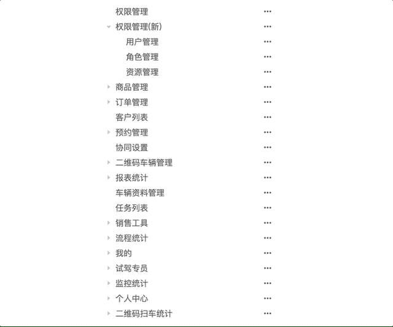
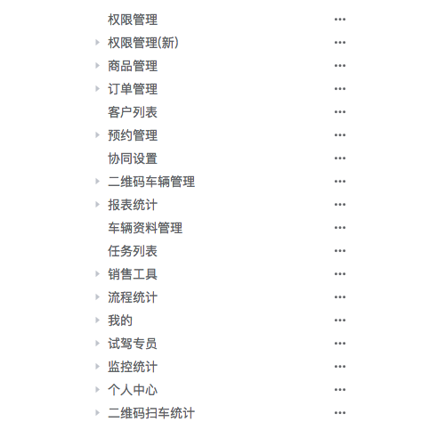
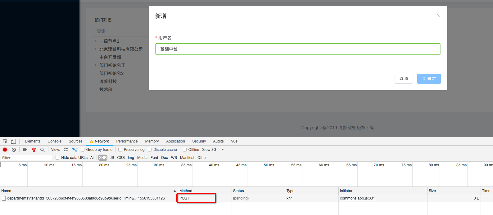
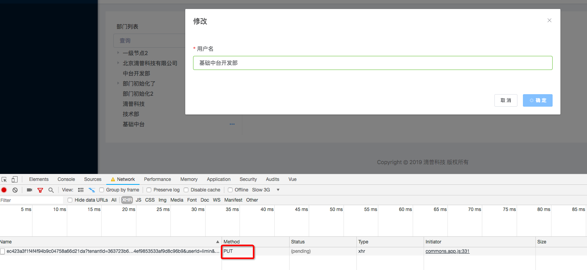

# el-data-tree

[](https://travis-ci.com/FEMessage/el-data-tree)
[](https://www.npmjs.com/package/@femessage/el-data-tree)
[](https://www.npmjs.com/package/@femessage/el-data-tree)
[](https://github.com/FEMessage/el-data-tree/blob/master/LICENSE)
[](https://github.com/FEMessage/el-data-tree/pulls)
[](https://github-tools.github.io/github-release-notes/)

使用`axios`自动发送请求，支持筛选, 自定义操作列, 让 RESTful 风格的 CRUD 更简单 👏



## Table of Contents <!-- omit in toc -->

* [Introduction](#introduction)
  * [CRUD](#crud)
* [Feature](#feature)
* [Demo](#demo)
* [Pre Install](#pre-install)
* [Install](#install)
* [Quick Start](#quick-start)
  * [Global Register Component](#global-register-component)
  * [Template](#template)
* [Contributors](#contributors)
* [License](#license)

## Introduction

### CRUD

el-data-tree 就是为了解决业务问题而生的，故而封装了 CRUD 的逻辑在里面。

以用户接口示例，设其相对路径为:

```sh
/api/v1/users
```

则其 restful CRUD 接口如下：

* 查询

```sh
GET /api/v1/users?type=1
```

* 新增

```sh
POST /api/v1/users
```

* 修改(编辑)

```sh
PUT /api/v1/users/:id
```

* 删除

```sh
DELETE /api/v1/users/:id
```

则只需要使用以下代码，即可完成 CRUD 功能

```vue
<template>
  <el-data-tree v-bind="treeConfig"></el-data-tree>
</template>
```

```js
<script>
export default {
  data() {
    return {
      treeConfig: {
        url: '/example/users',
        dataPath: 'data.payload',
        showFilter: true,
        form: [
          {
            $type: 'input',
            $id: 'name',
            label: '用户名',
            $el: {
              placeholder: '请输入'
            },
            rules: [
              {
                required: true,
                message: '请输入用户名',
                trigger: 'blur'
              }
            ]
          }
        ]
      }
    }
  }
}
</script>
```

效果如下：

* 查询



* 新增



* 修改



* 删除


[⬆ Back to Top](#table-of-contents)

## Feature

* 只需进行 json 配置，即可实现 restful 风格的 CRUD 四个接口的对接
* 可扩展自定义菜单栏，以及自定义操作函数
* 默认保存展开状态，新增、删除、编辑不丢失该状态
* 优化节点勾选方法

[⬆ Back to Top](#table-of-contents)

## Demo

* [doc and online demo](https://femessage.github.io/el-data-tree/)

[⬆ Back to Top](#table-of-contents)

## Pre Install

this component peerDependencies on [element-ui](http://element.eleme.io/#/zh-CN/component/tree) and [el-form-renderer](https://github.com/FEMessage/el-form-renderer) and [axios](https://github.com/axios/axios)

make sure you have installed in your project

```sh
yarn add element-ui @femessage/el-form-renderer axios
```

if you want to develop the component on your localhost, you should install with -P

```sh
yarn add element-ui @femessage/el-form-renderer axios -P
```

[⬆ Back to Top](#table-of-contents)

## Install

encourage using [yarn](https://yarnpkg.com/en/docs/install#mac-stable) to install

```sh
yarn add @femessage/el-data-tree
```

[⬆ Back to Top](#table-of-contents)

## Quick Start

### Global Register Component

this is for minification reason: in this way building your app,

webpack or other bundler just bundle the dependencies into one vendor for all pages which using this component,

instead of one vendor for one page

```js
import Vue from 'vue'

// register component and loading directive
import ElDataTree from '@femessage/el-data-tree'
import ElFormRenderer from '@femessage/el-form-renderer'
import {
  Button,
  Dialog,
  Dropdown,
  DropdownMenu,
  DropdownItem,
  Form,
  FormItem,
  Input,
  Loading,
  Tree,
  MessageBox,
  Message
} from 'element-ui'

Vue.use(Button)
Vue.use(Dialog)
Vue.use(Dropdown)
Vue.use(DropdownMenu)
Vue.use(DropdownItem)
Vue.use(Form)
Vue.use(FormItem)
Vue.use(Input)
Vue.use(Loading.directive)
Vue.use(Tree)
Vue.component('el-form-renderer', ElFormRenderer)
Vue.component('el-data-tree', ElDataTree)

// to show confirm before delete
Vue.prototype.$confirm = MessageBox.confirm
// if the tree component cannot access `this.$axios`, it cannot send request
import axios from 'axios'
Vue.prototype.$axios = axios
```

[⬆ Back to Top](#table-of-contents)

### Template

```vue
<template>
  <el-data-tree></el-data-tree>
</template>
```

[⬆ Back to Top](#table-of-contents)

## Contributors

Thanks goes to these wonderful people ([emoji key](https://allcontributors.org/docs/en/emoji-key)):

<!-- ALL-CONTRIBUTORS-LIST:START - Do not remove or modify this section -->

<!-- prettier-ignore -->
<!-- ALL-CONTRIBUTORS-LIST:END -->

This project follows the [all-contributors](https://github.com/all-contributors/all-contributors) specification. Contributions of any kind welcome!

[⬆ Back to Top](#table-of-contents)

## License

[MIT](./LICENSE)

[⬆ Back to Top](#table-of-contents)
